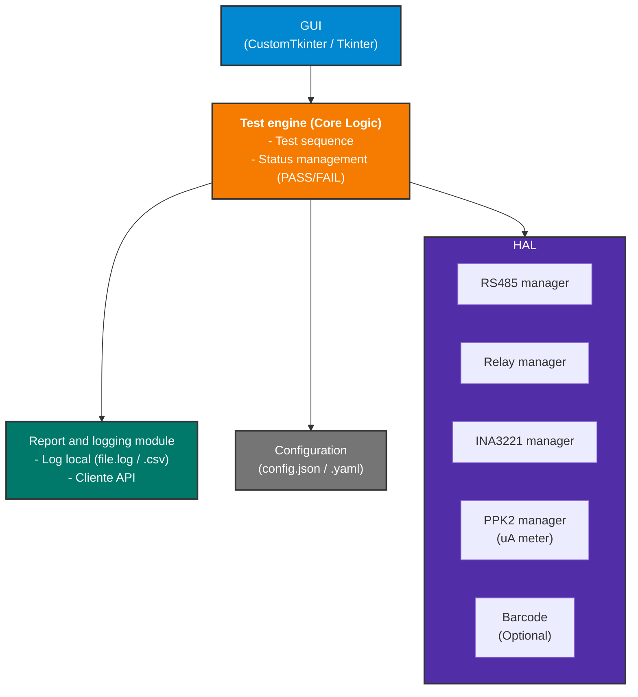
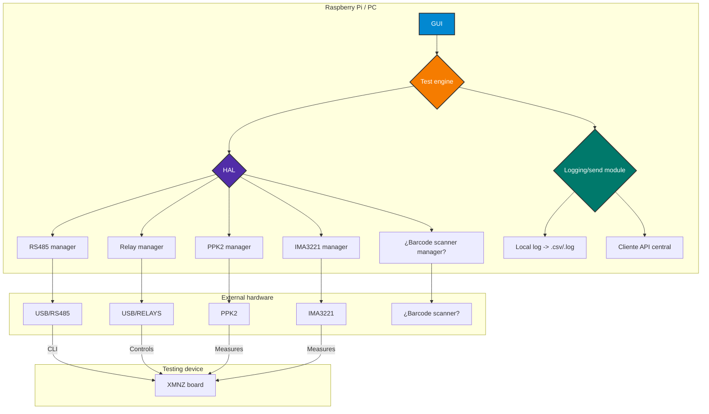

# Sistema de test automatizado para producción de XMNZ

## Diagramas

```mermaid
graph TD
    A["GUI<br/>(CustomTkinter / Tkinter)"] --> B;

    B["<b>Test engine (Core Logic)</b><br/>- Test sequence<br/>- Status management (PASS/FAIL)"];
    B --> C;
    B --> D;
    B --> E;

    subgraph C [HAL]
        direction LR
        C1[RS485 manager]
        C2[Relay manager]
        C3["INA3221 manager"]
        C4["PPK2 manager<br/>(uA meter)"]
        C5["Barcode<br/>(Optional)"]
    end

    D["Report and logging module<br/>- Log local (file.log / .csv)<br/>- Cliente API"];
    E["Configuration<br/>(config.json / .yaml)"];

    %% Estilos para mejorar la apariencia
    style A fill:#0288d1,stroke:#333,stroke-width:2px,color:white
    style B fill:#f57c00,stroke:#333,stroke-width:2px,color:white
    style C fill:#512da8,stroke:#333,stroke-width:2px,color:white
    style D fill:#00796b,stroke:#333,stroke-width:2px,color:white
    style E fill:#757575,stroke:#333,stroke-width:2px,color:white
```

```mermaid
graph TD
    subgraph "Raspberry Pi / PC"
        A[GUI] --> B{Test engine};
        B --> C{HAL};
        C --> C1[RS485 manager];
        C --> C2[Relay manager];
        C --> C3[PPK2 manager];
        C --> C4[IMA3221 manager];
        C --> C5[¿Barcode scanner manager?];
        B --> D{Logging/send module};
        D --> D1[Local log -> .csv/.log];
        D --> D2[Cliente API central];
    end

    subgraph "External hardware"
        C1 --> E[USB/RS485];
        C2 --> F[USB/RELAYS];
        C3 --> G[PPK2];
        C4 --> H[IMA3221];
        C5 --> I[¿Barcode scanner?];
    end

    subgraph "Testing device"
        E -- CLI --> J[XMNZ board];
        F -- Controls --> J;
        G -- Measures --> J;
        H -- Measures --> J;
    end

    style A fill:#0288d1,stroke:#333,stroke-width:2px,color:#fff
    style B fill:#f57c00,stroke:#333,stroke-width:2px,color:#fff
    style C fill:#512da8,stroke:#333,stroke-width:2px,color:#fff
    style D fill:#00796b,stroke:#333,stroke-width:2px,color:#fff
```